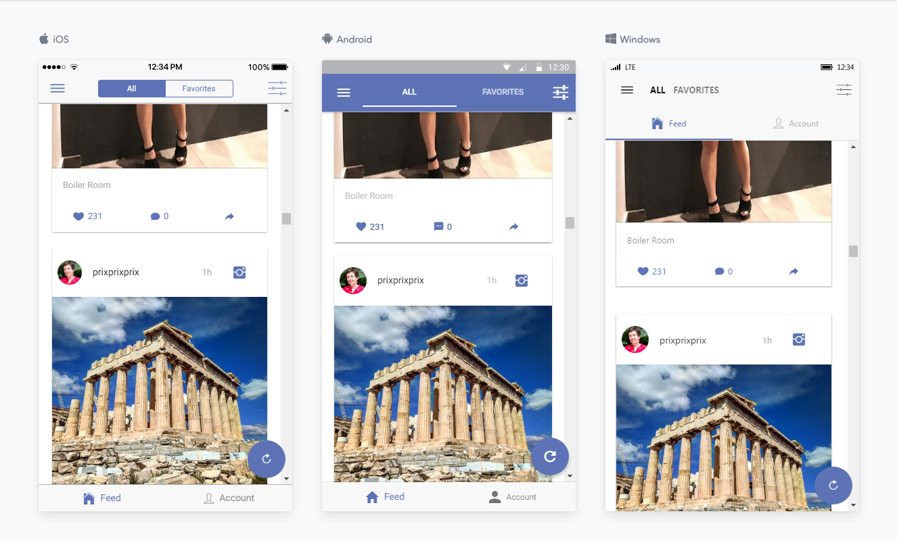
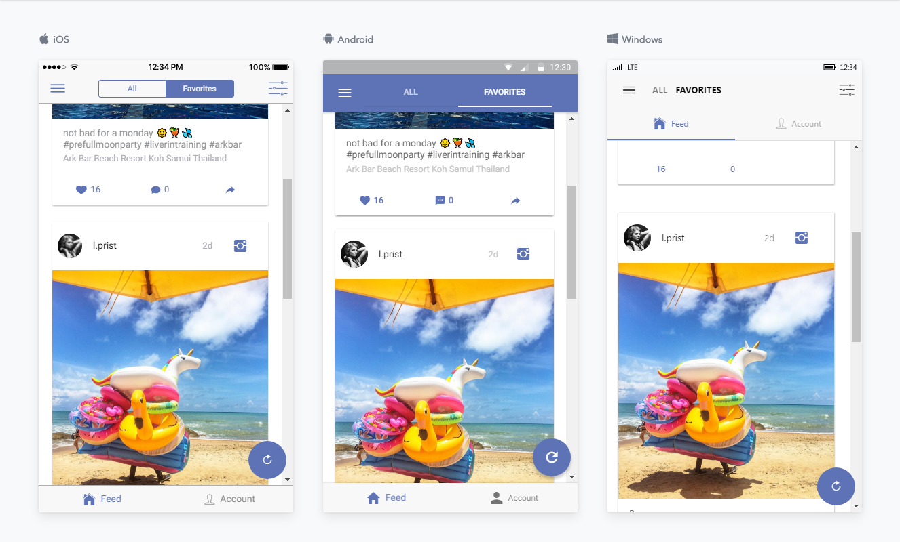
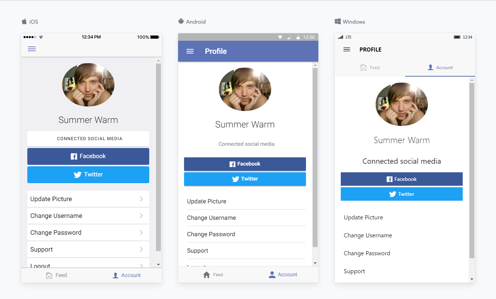
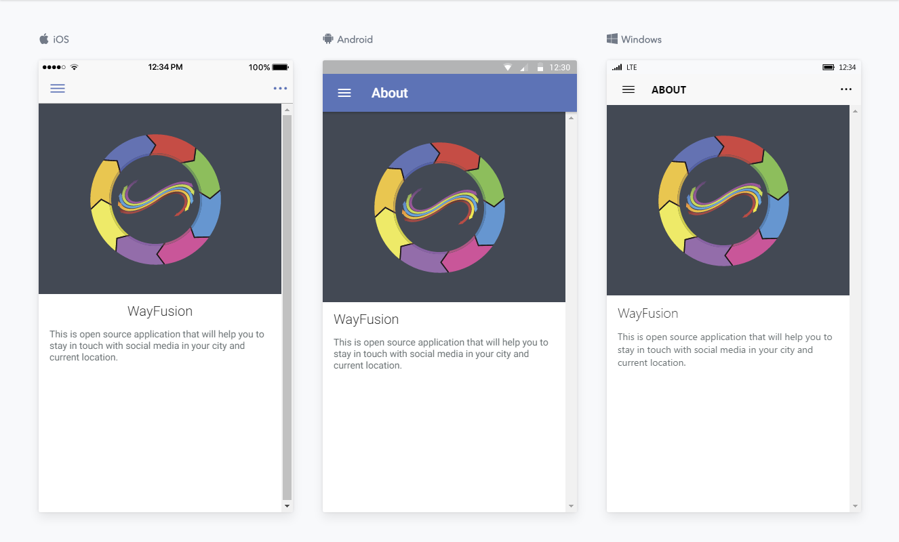

# WayFusion mobile app

This is application for analyzing social media in current city (location). It is still in development.

Built on top of [Ionic 3](https://ionicframework.com/),
[Angular 4](https://angular.io/),
[Cordova](https://cordova.apache.org/),
with [Typescript](https://www.typescriptlang.org/)
and pinch of love ♥.

Demo: [Google Play](https://play.google.com/store/apps/details?id=com.wayfusion.app) / [Web Version](http://app.wayfusion.com)

## Table of Contents
 - [Getting Started](#getting-started)
 - [App Preview](#app-preview)
 - [License](#license)

## Getting Started

### Quick Start

* Clone this repository: `git clone https://github.com/wayfusion/wayfusion-app.git`.
* Run `npm install` from the project root.
* Install cordova and ionic CLI `npm install -g cordova ionic`
* Run with browser `ionic serve` or with mobile `ionic cordova:run android`

## App Preview

- [Feed / Favorites Pages](https://github.com/wayfusion/wayfusion-app/blob/master/src/pages/feed/feed.html)

  
  
  

- [Profile Page](https://github.com/wayfusion/wayfusion-app/blob/master/src/pages/account/account.html)

  

- [About Page](https://github.com/wayfusion/wayfusion-app/blob/master/src/pages/about/about.html)

  

- To see more images of the app, check out the [screenshots directory](https://github.com/wayfusion/wayfusion-app/tree/master/resources/screenshots)!

## License

Copyright (c) 2017-present Sergio Khlopenkov. This source code is licensed under the [MIT](https://github.com/wayfusion/wayfusion-app/blob/master/LICENSE) license.

The documentation to the project is licensed under the [CC BY-SA 4.0](http://creativecommons.org/licenses/by-sa/4.0/) license.
